# Niko Phase - Initialization & Entry Point

This command determines task complexity, and routes to appropriate workflows based on the complexity level.

```mermaid
graph TD
    Start(("Start")) -."🧑‍💻 /niko".-> Step1["Load & Ensure Memory Bank"]
    Step1 --> Step1a{"User Input?"}
    Step1a --"No"--> Step1b["Initialize Memory Bank"]
    Step1b --> Done
    Step1a --"Initialization Request"--> Step1b
    Step1a --"Yes"--> Step2["Determine Complexity Level"]
    subgraph Complexity Analysis
        Step2 -.-> Step3["Load Complexity-Specific Rules"]
        Step3 -.-> Workflow["Follow level-specific workflow instructions"]
    end

    Done("Done")
```



## Step 1: Load & Ensure Memory Bank Persistent Files

```
Load: .cursor/rules/shared/niko/core/memory-bank-paths.mdc
Load: .cursor/rules/shared/niko/core/memory-bank-init.mdc
```

**CRITICAL:** If *at least one* of the memory-bank's persistent files does not exist, initialize the memory bank's persistent files *immediately* according to the defined process.

If there was no user input, or the only user input was to initialize the memory bank, you are done! Exit and do nothing else.

## Step 2: Determine Complexity Level

```
Load: .cursor/rules/shared/niko/core/complexity-analysis.mdc
```

Follow the instructions to determine the complexity level of the task.

Complexity analysis will populate the memory bank's ephemeral files & guide you to the next step.
